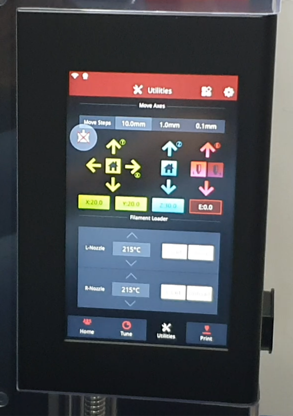
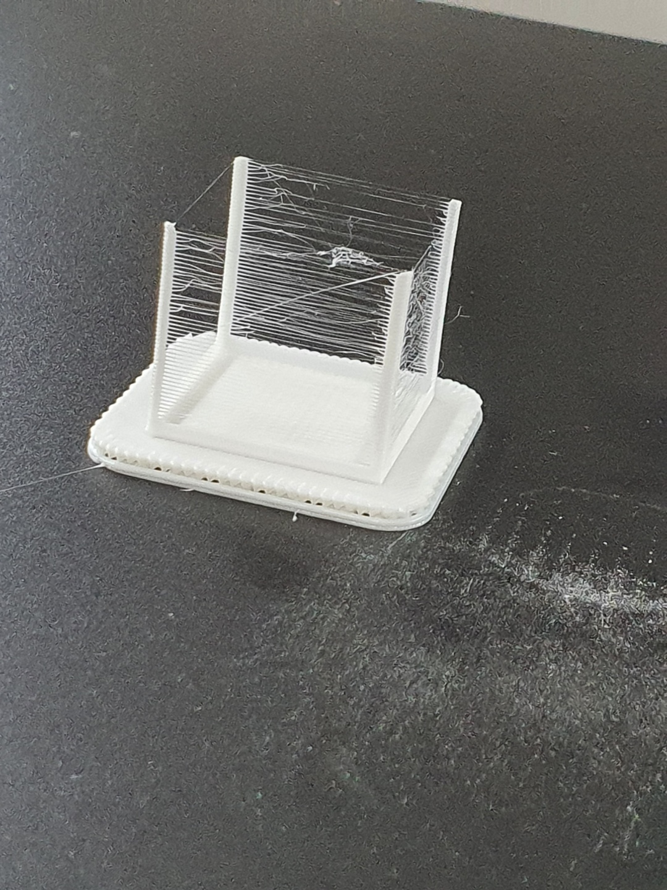
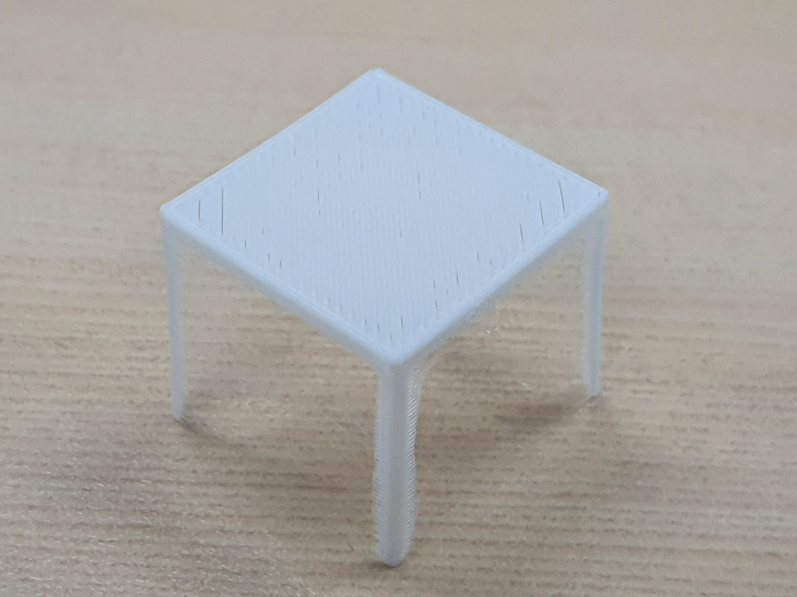
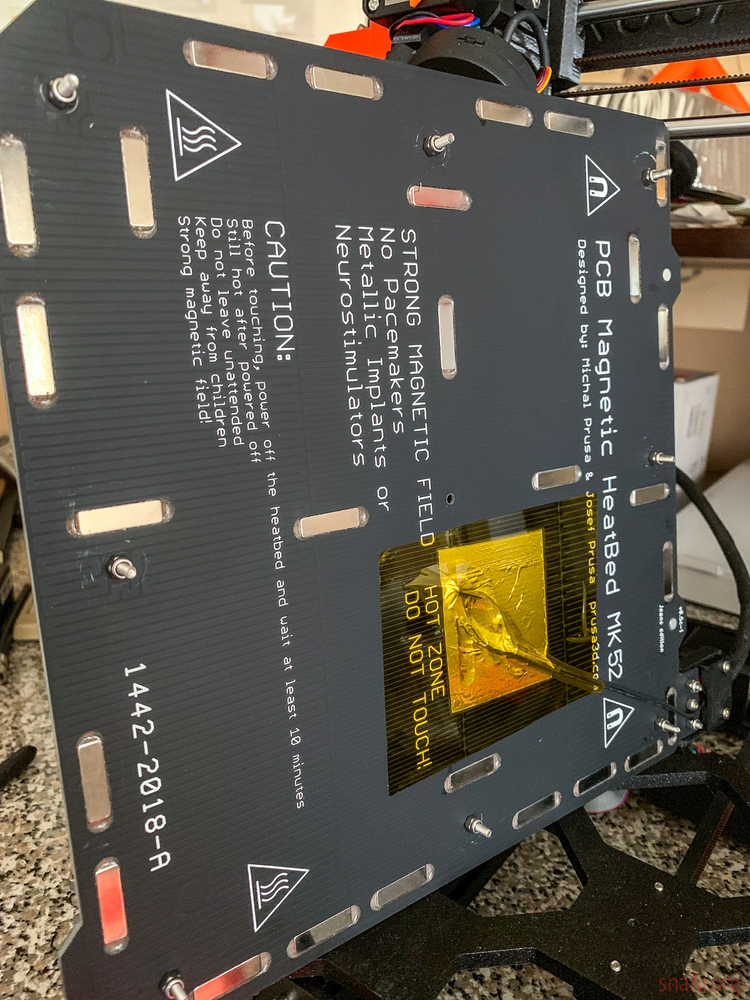

# Pro2 Plus\(Hardware\)

## Pro2 Plus

Pro2 Plus는 Dual extrusion Printer이다. Extruder가 2개 있는 제품.

Supported Materials :

* PLA / ABS / HIPS / PC / TPU / TPE / NYLON / PETG / ASA / PP / PVA / Glass Fiber Infused / Carbon Fiber Infused / Metal Fill / Wood Fill

connectivity : Wi-Fi, LAN, USB port

noise : 건물 안에서 50dB 이하

slicing software : IdeaMaker

Supported OS : WINDOWS/LINUX/macOS

Machine Code Type : GCODE

중량 : 

* 총중량 : 79.6kg \(팔레트 제외한 무게 : 71.8kg / 팔레트, Carton제외한 순 중량 : 59.3kg\)

특이사항 : 정전이 발생했을시 펌웨어에 기록돼서 별도의 과정없이 다시 출력하면 된다.

### Onboard

온보드는 pro2 plus 프린터에 달린 태블릿형태의 컴퓨터이다.

터치 스크린방식 GUI를 통해 온도조절, 팬 속도조절, 프린트 모델 불러오기 등을 다룰 수 있다.

#### Onboard의 세부성능

* 해상도 : 1024 \* 600
* 메모리 : 1GB / Onboard Flash : 8GB
* OS : Embedded Linux
* 포트 : USB 2.0 \* 2, Ethernet \* 1
* 작동방식 : 터치스크

#### Onboard의 기능

노즐의 크기조절, ..... Tp에 가서 Onboard 실제로 다루면서 기능별로 수정할 예정     

## Extruder

### Extruder 란?

익스트루더는 필라멘트를 압출하는 기능을 담당하는 기계적 장치다.

익스트루더는 Cold end와 Hot end로 나뉜다.

익스트루더가 필라멘트를 압출하는 과정은 다음의 두단계로 이루어진다.

1. 필라멘트가 익스트루더로 공급된다.
2. 필라멘트가 hot end\(extruder\) 안에서 녹노즐을 통해 빠져나온다.

그림에서 볼수 있듯이 Cold-End부분의 roller가 Filament를 밀어내고 Filament가 Hot-end 부분으로 들어가서 녹아 노즐을통해 나오게된다. Hot-End는 필라멘트를 녹여 사출하는 부분인 것이다.

#### Pro2 Plus는 FFF 출력방식을 쓰는데 FFF란,

헤드와 필라멘트 공급장치가 결합된 채로 움직이는 방식이다. 다이렉트 방식이라 하기도 한다.

즉, 콜드엔드와 핫엔드사이가 거의 붙어있거나 멀리 떨어져 있지 않다는 뜻이다.

위의 이유로 필라멘트 교체가 쉽고 다루기 편하다.

## Connection

onboard의 네트워크 선택을 통해 Wifi에 연결하면 ideaMaker 프로그램에서 네트워크와 연결된 

Pro2 Plus를 인식하여 연결할 수 있다. 

PC와 Pro2 Plus를 연결하면 제품 내부에있는 카메라를 통해 실시간으로 확인하여 출력이 제대로 되고있는지 확인 할 수 있는 장점이 있다.

단, Pro2 Plus와의 연결은 1:1연결만을 권장한다.  \(안정성 문제\)

## Filament

### 종류

#### PLA

* ABS에 비해 강한 표면강도를 가지는대신 잘부러진다. 즉, 유연성이 낮고 강도는 Medium정도이다.
* PLA필라멘트로 출력한 모델은 사포질, 페인트칠, 접착제 사용이 가능하지만 표면을 부드럽게 하기위한 아세톤 사용은 불가하다.
* PLA의 경우 프린팅 할때 일반적인 노즐 온도가 210~220°C 이다.
* 출력 난이도가 낮아서 3D print 초보자들이 사용하기에 좋다.

#### ABS

* ABS는 내부충격에 더 강하여 비바람에 견디는 물건이나 기계적 부품의 출력에 더 알맞다.
* PLA보다 후가공에 용이해서 앞서 말한 사포,페인트, 접착제 뿐만 아니라 아세톤 사용도 가능하다.
* ABS의 경우 프린팅 할 때 일반적인 노즐 온도가 230°C 이다.

PLA, ABS의 기타 세부적인 특성들 또는 다른 종류의 재료\(Nylon, PVA, PC, ASA\)에 대 좀 더 알아보고 싶다면 다음 링크를 참조하면 도움이 될듯. [filament\_wiki](https://en.wikipedia.org/wiki/3D_printing_filament)

### 교체 방식

#### 1\) loading : **Extruder에 filament가 없는 상태에서 출력을 위해 filament를 삽입하여 밀어내는 과정**

#### 2\) unloading : Extruder에서 filament를 빼는 과정

**Filament를 다 썼을 경우\)**

filament를 다썼을 경우 센서가 인식하여 익스트루더가 최하단 좌측으로\(0,0\) 으로 이동하게된다. 

filament를 교체하고 loading을 하면 다시 출력할 수 있게 된다. 

loading 방법 : 

손으로 필라멘트를 넣다가 gear에 걸리면 더 들어가지 않는데 어느정도 느낌이 드는 순간까지 필라멘트를 집어넣는다. 필라멘트를 집어넣은 후 loading 버튼을 누르면 기어를 통해 필라멘트가 cold-end로 들어가게된다. \(loading했을시 기어가 필라멘트를 제대로 집어넣는지 확인하자. 또한 filament가 들어간 후에 노즐을 통해 나오는지 확인 후 Ok버튼 클릭\)

loading 후 이물질\(filament 찌꺼기\)은 제거

출력중에 filament를 모두 썼을경우 Pause를 누르고 필라멘트를 교체 후 resume해주면 된다.

**Extruder가 막혔을 경우\)**

Extruder가 막혔을 경우 unloading을 하면 filament가 빠진다. unloading을 한 후 쇠 청소 막대기로 extruder 안을 밀어넣으며 청소해주면 노즐을 통해 막힌 이물질이 나온다. 

## Print

### 출력 후 작업

1. 출력을 하면 Raft와 그외의 Support를 포함한 결과물이 나온다.

      2. 다음과 같은 결과물이 나오면 히팅베드가 어느정도 식을때까지 둔 후에 헤라로 Raft의 모서리부분에 충격을 주며 결과물을 히팅베드에서 분리시킨다.

      3.  분리시킨 결과물의 서포트를 니퍼, 칼 등의 도구를 사용하여 제거 하면 끝.    

### 출력 성공률 높이는 방법

FDM 방식의 출력에서 \*Support를 사용하여 형태가 온전한 모델을 출력할 수 있다. 

\*Support 란? : 출력물의 허공에 뜬 부분을 지지해주기 위해 출력물 아래에 만들어주는 지지대    

Support로는 바닥 보조물\(Raft, Brim, skirt\)과 경사진 부분을 지탱해주는 지지대\(Support\)가 있다.

* 바닥 보조물 참고링크 :[ here](https://m.blog.naver.com/PostView.nhn?blogId=vip_khu&logNo=221500093284&proxyReferer=https:%2F%2Fwww.google.com%2F)

3D프린팅은 시간이 오래걸리기 때문에 퇴근하기전에 출력설정을 해둔 뒤 다음날에 결과물을 보는 경우가 있는데, 이때에는 Raft\(바닥보조물\)이 성공적이면 출력물 전체도 성공적일 확률이 높으므로 Raft의 출력만 본 후에 방치해두어도 출력의 실패 가능성을 줄일 수 있다.

## Fan

Fan 잔여 필라멘트등의 이물질이 자주 낄수 있어 주기적으로 확인해 청소해주는것이 좋다.

## Heating bad

히팅베드란 FDM 방식의 3D프린터에서 사용되는 바닥재이다.

히팅베드는 모델이 출력될때의 평평한 바닥역할과 사출된 필라멘트의 \*warping을 막기위한 온도유지 역할을 한다. 

\*warping 이란 노즐에서 압출된 고온의 filament가 상온의 온도에 노출되면서 형태가 일그러지는 현상.

 히팅베드는 FDM방식의 3D Printer에서 필수적이며 고온이기 때문에 직접적인 접촉은 피해야 한다. 

Pro2 Plus도 heating bed를 사용하며 공식 홈페이지에서는 '탁월한 warping 방지', '고른 열분배', '긴 수명'등의 장점이 있다고 설명돼있다.'

## 원격연결방법   
   
프린터와 PC가 같은 Wifi를 사용하고있다면 PC에서 ideamaker의 프린터 스캐닝 기능을 통해 같은 네트워크에 있는 프린터를 스캔하여 연결할 수 있다.
또는 동일한 이더넷을 사용하면 연결할 수 있다.

이 방법 외에 RaiseCloud를 사용하면 Wifi나 이더넷에 상관없이 Cloud를 통해서 연결을 할 수 있고
RaiseCloud는 모바일용 Application도있어 휴대폰에서도 출력이나 프린팅 과정 모니터링이 가능하다.
(프린트를 RaiseCloud의 계정과 Bind하는 작업이 필요한데 이미 Bind해줬으나 만약 어떠한 이유로 다시 Bind를 해야한다면 https://cloud.raise3d.com/html/howtobind.html를 참고)   

RaiseCloud Web_Link(PC) : https://cloud.raise3d.com/raise3d.html   
RaiseCloud APP(Mobile) : https://play.google.com/store/apps/details?id=com.raise3d.raisecloud
   
Web기준으로 설명하겠습니다.

웹에 접속한 후 로그인을 하면 다음과 같은 첫화면이 나옵니다.   
   
우측상단의 계정 이름부분을 클릭하면 
   
이렇게 DashBoard, Sign out버튼이 나오는데 DashBoard를 눌러줍니다.   
   

Dashboard에는 Printer의 작업상황과 시간별 Filament 사용량 그래프, Team Information이 나옵니다.
   
출력중인 작품의 진행상황 또는 설정변경, 정지, 재개등을 하려면 Printing(N)을 클릭해줍니다.   
   
Printing버튼을 클릭하면 다음과 같이 좌측, 우측노즐과 히팅베드, 기타 세부옵션등의 값들이 나오고   
프린트 진행상황, 좌측노즐과 우측노즐의 Filament 잔량이 뜹니다.   
   
      
우측상단의 동그라미친 버튼을 누르게되면   
   
다음과 같이 현재 진행중인 작업의 일시정지, 정지, 재개등의 기능을 사용할 수 있고   
Raise-Pro시리즈의 제품에 포함된 프린트 내부 Camera를 통해 진행상황을 실시간으로 모니터링 할 수도 있습니다.    
(사진에서는 Camera를 Activate하지 않아 보이지 않음)   
   
진행상황과 카메라를 통한 모니터링 등 거의 모든 RaiseCloud의 기능들을 APP을 통해 모바일에서도 사용할 수 있습니다.

## RaiseCloud를 통해서 모델을 Slicing하고 출력하는 방법   
RaiseCloud에 .stl파일(모델)이 업로드되었다면 이 모델을 슬라이싱한 후 추출된 Gcode파일을 통해 프린트를 할 수 있습니다.   
   
   
위 그림과 같이 stl파일에 커서를올리면 동그라미 친 부분의 Slice버튼이 보이는데 이 버튼을 클릭해 모델을 Slice합니다.   
Slice는 Ideamaker를 통해서 할 수 있습니다.   
서포트를 대주고 모델의 출력품질 등을 설정한 후 슬라이싱하면 Gcode파일이 생성되는데 이 파일을 RaiseCloud로 업로드해줍니다.   
   
   
업로드 된 Gcode파일에 커서를 올리면 프린트 버튼(동그라미 친 버튼)이 보입니다. 이제 출력을 위한 모든 준비가 끝났습니다.

  

