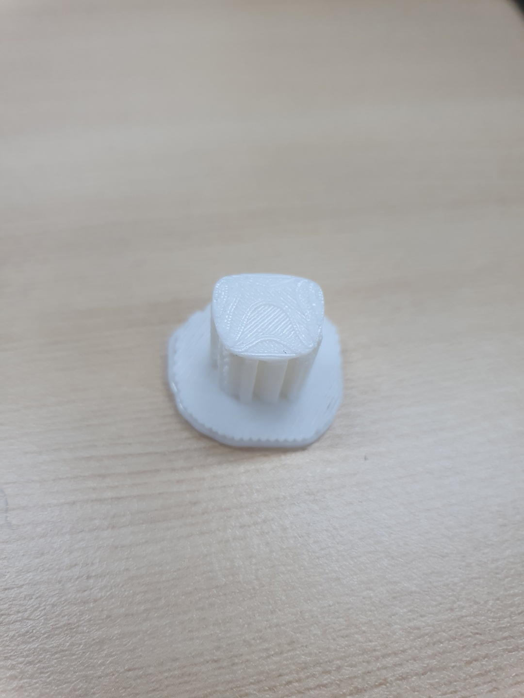
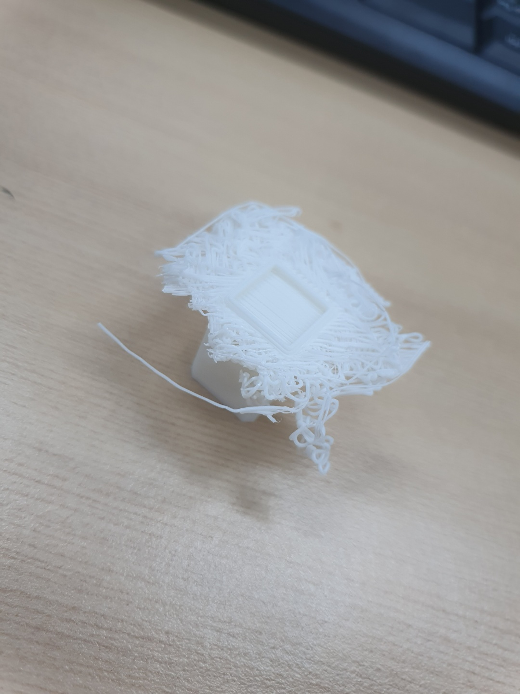
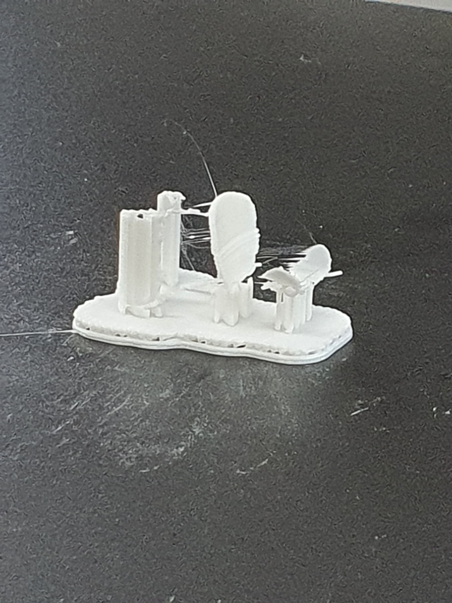

# Archive

## \`21.04.07\(수\)

* 제목 : sample chair 4
* 사진 : 

* 용도 : 샘플
* 크기\(mm\) : 14.5 x 13.9 x 22.8
* 소요 시간 / 품질: 13분 / 표준
* 결과 : 실패\(의자의 등받이부분이 출력되지 않음\) / 등받이 부분이 아래로가게 lay flat하여 출력하면 해결가능할 것으로 보임   

## \`21.04.07\(수\)

* 제목 : sample desk 6
* 사진 : 

* 용도 : 샘플   
* 크기\(mm\) :  34.1 x 22.8 x 20.8
* 소요 시간 / 품질 : 12분 / 표준
* 결과 : 성공 / 크기가 작은 모델들은 출력 후 서포트를 제거할 때 신경을 써야할것 같음   

## \`21.04.07

* 제목 : sample table 3
* 사진 : 

* 용도 : 샘플      
* 크기\(mm\) : 39.8 x 39.8 x 21.2 
* 소요 시간 / 품질 : 29분 / 표준    
* 결과 : 탁자의 밑부분과 윗부분은 제대로 출력되었으나 옆의 넓은부분은 실패하였음\(사진은 실패한 옆면을 떼는 과정에 찍음\)

## \`21.04.07\(수\)

* 제목 : sample chair 4
* 사진 : 

* 용도 : 기존에 뽑았던 의자4의 등받이 출력실패 후 lay flat하여 재출력
* 크기\(mm\) :  25.1 x 14.4 x 15.9
* 소요 시간 / 품질 : 10분 / 표준
* 결과 : 반성공 / 기본적으로 모델이 축소버전이라 의자의 다리가 매우얇아서 잘 출력되지 않았다. 기존 출력하였던 모델을 lay flat하여더니 등받이는 제대로 출력됨  

## \`21.04.20

* 제목 : sample before print(sliced model)
* 사진 : 
* 용도 : 샘플 출력
* 결과 : 

## \`21.04.20

* 제목 : sample desk before print #1(sliced model)
* 사진 : 
* 용도 : 샘플 출력
* 크기\(mm\) : 23.5 x 15.7 x 14.3 (69% scale)
* 소요 시간 / 품질 : 최고급 / 15분
* 결과 : 실패 / 크기가 너무작아 책상윗면이 출력되지않았고 또한 다리가 반정도높이까지 출력되다가 그 윗부분은 동일하게 크기문제로 흘러내림
 

## \`21.04.20

* 제목 : sample desk before print #2(sliced model)
* 사진 : 
* 용도 : 샘플 출력
* 크기\(mm\) : 23.5 x 15.7 x 14.3 (69% scale)
* 소요 시간 / 품질 : 고급 / 9분
* 결과 : 실패 / 책상다리는 모두 출력됐으나 책상 윗면이 출력되지않음

## \`21.04.20

* 제목 : sample desks for finding error
* 사진 : 
* 용도 : sample desk before print(#1, #2)의 책상 윗부분이 출력되지않는 현상의 원인을 원본 스케일과 비교하여 알고자 각 책상의 69%, 100% 모델을 모두 출력
* 크기\(mm\) : 34.1x22.8x20.8 / 23.5x15.7x14.3 / 22.7x22.8x20.8 / 15.7x15.7x14.3
* 소요 시간 / 품질 : 47분 / 고급
* 결과 : 

실패 / 온전하게 나온 책상은 정사각형의 100%scale책상이고 비교적 정사각형책상의 69%scale도 잘나왔다.
하지만 scale100%의 직사각형 책상은 한쪽다리가 출력되지 않았으며 69%scale 작은책상은 아예 출력되지 않았다.
출력결과를 보니 크기(scale)과 출력품의 성공이 어느정도 비례한다고 생각한다.

## \`21.04.22

* 제목 : 탁자 샘플
* 사진 : 
* 용도 : 샘플 출력
* 크기\(mm\) : 59.7 x 59.7 x 31.8 (150% scale) 
* 소요 시간 / 품질 : 고품질 / 160분
* 결과 : 

## \`YY.MM.DD

* 제목 : 
* 사진 : 
* 용도 : 
* 크기\(mm\) :  
* 소요 시간 / 품질 :
* 결과 : 

## \`YY.MM.DD

* 제목 : 
* 사진 : 
* 용도 : 
* 크기\(mm\) :  
* 소요 시간 / 품질 :
* 결과 : 

