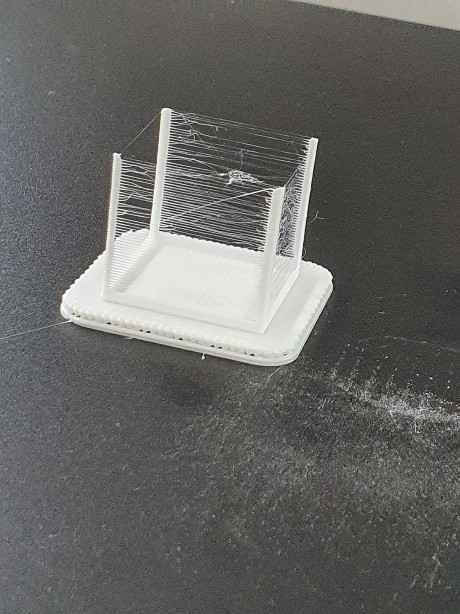

# Archive

## \`21.04.07\(수\)

* 제목 : sample chair 4
* 사진 : 

* 용도 : 샘플
* 크기\(mm\) : 14.5 x 13.9 x 22.8
* 소요 시간 / 품질: 13분 / 표준
* 결과 : 실패\(의자의 등받이부분이 출력되지 않음\) / 등받이 부분이 아래로가게 lay flat하여 출력하면 해결가능할 것으로 보임   

## \`21.04.07\(수\)

* 제목 : sample desk 6
* 사진 : 

* 용도 : 샘플   
* 크기\(mm\) :  34.1 x 22.8 x 20.8
* 소요 시간 / 품질 : 12분 / 표준
* 결과 : 성공 / 크기가 작은 모델들은 출력 후 서포트를 제거할 때 신경을 써야할것 같음   

## \`21.04.07

* 제목 : sample table 3
* 사진 : 

* 용도 : 샘플      
* 크기\(mm\) : 39.8 x 39.8 x 21.2 
* 소요 시간 / 품질 : 29분 / 표준    
* 결과 : 탁자의 밑부분과 윗부분은 제대로 출력되었으나 옆의 넓은부분은 실패하였음\(사진은 실패한 옆면을 떼는 과정에 찍음\)

## \`21.04.07\(수\)

* 제목 : sample chair 4
* 사진 : 

* 용도 : 기존에 뽑았던 의자4의 등받이 출력실패 후 lay flat하여 재출력
* 크기\(mm\) :  25.1 x 14.4 x 15.9
* 소요 시간 / 품질 : 10분 / 표준
* 결과 : 반성공 / 기본적으로 모델이 축소버전이라 의자의 다리가 매우얇아서 잘 출력되지 않았다. 기존 출력하였던 모델을 lay flat하여더니 등받이는 제대로 출력됨  

## \`YY.MM.DD

* 제목 : 
* 사진 : 
* 용도 : 
* 크기\(mm\) :  
* 소요 시간 / 품질 :
* 결과 : 

## \`YY.MM.DD

* 제목 : 
* 사진 : 
* 용도 : 
* 크기\(mm\) :  
* 소요 시간 / 품질 :
* 결과 : 

## \`YY.MM.DD

* 제목 : 
* 사진 : 
* 용도 : 
* 크기\(mm\) :  
* 소요 시간 / 품질 :
* 결과 : 

## \`YY.MM.DD

* 제목 : 
* 사진 : 
* 용도 : 
* 크기\(mm\) :  
* 소요 시간 / 품질 :
* 결과 : 

## \`YY.MM.DD

* 제목 : 
* 사진 : 
* 용도 : 
* 크기\(mm\) :  
* 소요 시간 / 품질 :
* 결과 : 

## \`YY.MM.DD

* 제목 : 
* 사진 : 
* 용도 : 
* 크기\(mm\) :  
* 소요 시간 / 품질 :
* 결과 : 

## \`YY.MM.DD

* 제목 : 
* 사진 : 
* 용도 : 
* 크기\(mm\) :  
* 소요 시간 / 품질 :
* 결과 : 

